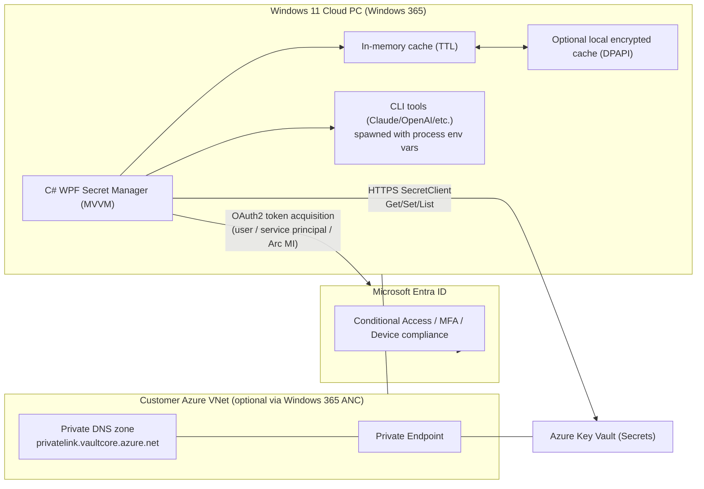

# Secure Secret Storage and Retrieval from a Windows 11 Cloud PC Using Azure Key Vault

## Executive summary

Azure Key Vault is Microsoft’s managed service for **secrets management** (API keys, tokens, passwords, connection strings), **key management**, and **certificate management**, with centralized control over distribution and access to those assets. citeturn28view0 It integrates with **Microsoft Entra ID** for authentication and supports authorization via **Azure RBAC** or legacy access policies; Microsoft’s current guidance emphasizes Azure RBAC for Key Vault data-plane access control. citeturn28view0turn1search0

On a **Windows 11 Cloud PC (Windows 365)**, your best choices depend on how your Cloud PC is joined/networked. Windows 365 Cloud PCs integrate with **Intune** and **Microsoft Entra ID**, and can be deployed with an **Azure network connection (ANC)** into your Azure virtual network for private connectivity. citeturn14view0turn14view1 In an ANC model, the Cloud PC’s **virtual network adapter is provisioned in the customer-owned subscription VNet**, enabling private access patterns (for example, to a Key Vault private endpoint) that resemble a normal corporate workstation in a VNet. citeturn14view0 At the same time, the Cloud PC VM itself runs “hosted on behalf of” Windows 365 in Microsoft-owned subscriptions, which affects what “native Azure VM features” you can directly configure on the VM resource. citeturn14view0

For an interactive AI developer workflow (CLI tools like Claude CLI, OpenAI/Codex, etc.), the most practical secure patterns are:
- **User-based Entra authentication** from the WPF app (SSO + Conditional Access + MFA), with Key Vault RBAC granting you least-privilege read or operator roles. Key Vault explicitly supports Conditional Access policies. citeturn18view0turn28view1  
- **“Managed identity” style auth** only if your compute has managed identity endpoints. Windows 365 Cloud PCs are SaaS-managed VMs, but you can achieve a managed-identity-like pattern by onboarding the machine to **Azure Arc-enabled servers**, which enables obtaining tokens as a system-assigned managed identity to access services like Key Vault. citeturn15view0  
- **Service principals** (confidential clients) are workable for non-interactive tooling, but introduce local key material to protect (client secret or certificate). Key Vault guidance still prefers managed identity where possible; otherwise you register an application/service principal and authenticate that way. citeturn28view1

Finally, plan for performance and resilience: Microsoft recommends **caching secrets in memory** (often “at least 8 hours”), **exponential backoff retries**, and **refresh on rotation** to reduce requests and handle Key Vault throttling/limits safely. citeturn20view0turn9search0turn18view2

## Inventory of typical AI developer secrets and environment variables

### Notes on conventions and naming

Key Vault secret names are constrained: in the Azure portal quickstart, secret names must be **unique within a vault**, **1–127 characters**, **start with a letter**, and contain only **0-9, a-z, A-Z, and hyphen (-)**. citeturn25view1 The Key Vault REST API further shows `secret-name` matching `^[0-9a-zA-Z-]+$`. citeturn32view0

The environment-variable names below follow common developer conventions (uppercase + underscores) and are meant to help standardize your local tooling. Your actual tools may differ; treat this table as a **baseline**, not a guarantee.

### Inventory table

| Typical key / setting | Purpose in AI/dev workflow | Scope | Sensitivity | Recommended Key Vault secret name (example) | Suggested environment variable name |
|---|---|---|---|---|---|
| OpenAI API key | Authenticate OpenAI/Codex API requests | Personal or org | High | `openai-api-key` | `OPENAI_API_KEY` |
| OpenAI organization or project identifier | Routing/billing context (if used) | Org/project | Medium | `openai-org-or-project` | `OPENAI_ORG_ID` or `OPENAI_PROJECT_ID` |
| Anthropic/Claude API key | Authenticate Claude/Anthropic API or Claude CLI usage | Personal or org | High | `anthropic-api-key` | `ANTHROPIC_API_KEY` |
| “Crush” API key (tool-specific) | Authenticate to the “Crush” AI tool/CLI/service | Personal/team | High | `crush-api-key` | `CRUSH_API_KEY` |
| Azure OpenAI endpoint | Endpoint URL for Azure OpenAI resource | Project/env | Medium | `azure-openai-endpoint` | `AZURE_OPENAI_ENDPOINT` |
| Azure OpenAI API key (if used) | Key-based auth for Azure OpenAI (not preferred vs Entra where available) | Project/env | High | `azure-openai-api-key` | `AZURE_OPENAI_API_KEY` |
| Azure OpenAI deployment name | Deployment identifier for model routing | Project/env | Low | `azure-openai-deployment` | `AZURE_OPENAI_DEPLOYMENT` |
| Azure subscription ID | CLI/SDK targeting (ops scripts) | Org | Medium | `azure-subscription-id` | `AZURE_SUBSCRIPTION_ID` |
| Azure tenant ID | Explicit tenant targeting for auth flows | Org | Medium | `azure-tenant-id` | `AZURE_TENANT_ID` |
| Entra app client ID (service principal) | App identity for service-to-service auth | Org/app | Medium | `azure-client-id` | `AZURE_CLIENT_ID` |
| Entra app client secret (service principal) | Secret credential for app auth (avoid if possible) | Org/app | High | `azure-client-secret` | `AZURE_CLIENT_SECRET` |
| Entra app client certificate (PFX/PEM) | Certificate credential for app auth | Org/app | High | `azure-client-cert-pfx` | `AZURE_CLIENT_CERT_PATH` (or thumbprint variable) |
| Key Vault URI | Target vault address | Project/env | Low | `keyvault-uri` | `KEYVAULT_URI` |
| GitHub personal access token | Git operations, CI interactions, package access | Personal/org | High | `github-token` | `GITHUB_TOKEN` or `GH_TOKEN` |
| GitHub app private key (PEM) | GitHub App auth | Org | High | `github-app-private-key` | `GITHUB_APP_PRIVATE_KEY` |
| Hugging Face token | Model downloads, repos | Personal/org | High | `huggingface-token` | `HF_TOKEN` |
| Docker Hub token | Pull/push images | Personal/org | High | `dockerhub-token` | `DOCKERHUB_TOKEN` |
| NPM token | Publish/install private packages | Org | High | `npm-token` | `NPM_TOKEN` |
| PyPI token | Publish Python packages | Org | High | `pypi-token` | `PYPI_TOKEN` |
| AWS access key ID | AWS API access | Org/user | High | `aws-access-key-id` | `AWS_ACCESS_KEY_ID` |
| AWS secret access key | AWS API access | Org/user | High | `aws-secret-access-key` | `AWS_SECRET_ACCESS_KEY` |
| AWS session token | Temporary AWS credentials | Session | High | `aws-session-token` | `AWS_SESSION_TOKEN` |
| AWS default region | Target region | Project/env | Low | `aws-default-region` | `AWS_DEFAULT_REGION` |
| Google API key (Gemini/others) | Google API access | Project/org | High | `google-api-key` | `GOOGLE_API_KEY` |
| GCP service account JSON | GCP workload identity via key file (avoid long-lived keys if possible) | Org/app | High | `gcp-service-account-json` | `GOOGLE_APPLICATION_CREDENTIALS_JSON` (or path variable) |
| Azure Storage connection string | Data access | Project/env | High | `storage-connection-string` | `AZURE_STORAGE_CONNECTION_STRING` |
| Azure Storage account key | Data access (prefer SAS or Entra where feasible) | Project/env | High | `storage-account-key` | `AZURE_STORAGE_KEY` |
| Azure App Insights connection string | Telemetry setup | Project/env | Medium | `appinsights-connection-string` | `APPLICATIONINSIGHTS_CONNECTION_STRING` |
| Postgres connection string | App DB connectivity | Project/env | High | `postgres-connection-string` | `DATABASE_URL` |
| Redis connection string/key | Cache connectivity | Project/env | High | `redis-connection-string` | `REDIS_URL` |
| Slack bot token | Bot integration | Workspace/app | High | `slack-bot-token` | `SLACK_BOT_TOKEN` |
| Slack signing secret | Verify Slack requests | Workspace/app | High | `slack-signing-secret` | `SLACK_SIGNING_SECRET` |
| Sentry auth token | Release/issue automation | Org/app | High | `sentry-auth-token` | `SENTRY_AUTH_TOKEN` |
| SerpAPI (or similar) key | Web search tool in agents | Personal/org | High | `serpapi-api-key` | `SERPAPI_API_KEY` |
| Tavily (or similar) key | Web search tool in agents | Personal/org | High | `tavily-api-key` | `TAVILY_API_KEY` |
| Vector DB API key (Pinecone/Qdrant/etc.) | Vector search/indexing | Project/env | High | `vector-db-api-key` | `VECTOR_DB_API_KEY` |
| Vector DB endpoint | Vector DB base URL | Project/env | Medium | `vector-db-endpoint` | `VECTOR_DB_ENDPOINT` |
| SMTP password / app password | Email notifications | Org/app | High | `smtp-password` | `SMTP_PASSWORD` |
| Internal tool API key | Company tooling | Org/team | High | `internal-tool-api-key` | `INTERNAL_TOOL_API_KEY` |

## Secure solution architecture for a WPF secret manager on a Windows 11 Cloud PC

### Core security and platform facts to anchor design

Azure Key Vault is accessed through HTTPS endpoints. For vaults, the data-plane endpoint format is `https://{vault-name}.vault.azure.net`. citeturn8view0turn25view0 All requests to Key Vault **must be authenticated** using **Microsoft Entra access tokens** obtained via OAuth2, sent via the HTTP `Authorization: Bearer <access_token>` header. citeturn8view0turn28view1

Key Vault “secrets” are opaque strings to the service: values are stored as encrypted data and returned later; the service does not impose semantics on the secret content. citeturn26view0 Secrets are encrypted at rest; Microsoft documents a hierarchy of keys with protection by FIPS 140-2 compliant modules, with the root key protected by a FIPS 140-2 Level 3 (or higher) validated module. citeturn26view0turn28view0

On Windows 365 Cloud PCs with an **Azure network connection**, Windows 365 uses a hosted-on-behalf-of model: the Cloud PC runs in Microsoft-owned Azure subscriptions, while the Cloud PC’s network adapter is provisioned in the customer’s subscription VNet—enabling private connectivity patterns into customer VNets. citeturn14view0 This matters for private endpoints and for what identity features are “natively” configurable on the VM resource.

### Recommended architecture components and controls

**Desktop app (C# WPF, MVVM)**
- Implements: “vault browser”, “secret retrieval”, “secret set/update”, “export to env vars (process scope)” and “audit-friendly UI”.
- Uses Azure SDK clients (`Azure.Security.KeyVault.Secrets.SecretClient`) to Get/Set secrets. The .NET `SecretClient` supports managing secrets (create, retrieve, update, delete, purge, backup, restore, list), which is useful if your tool includes lifecycle features. citeturn17search3

**Authentication options (choose based on your risk + ops constraints)**

**Entra user authentication (most natural for a developer-operated Cloud PC)**
- Key Vault supports Entra authentication and can apply Conditional Access policies. citeturn28view1turn18view0  
- Your WPF app uses a user credential flow (interactive/browser/brokered). Azure.Identity supports credential chaining; interactive browser and broker flows exist as options, and DefaultAzureCredential can be customized (interactive is excluded by default unless enabled). citeturn33view0turn33view1  
- Pros: no long-lived client secrets on disk; works well with MFA/CA; aligns with “user-only” Key Vault access scenario. citeturn28view1  
- Cons: user presence required; background automation is limited.

**Managed identity (best for automation, but depends on compute support)**
- Microsoft recommends managed identity as the preferred way to obtain a service principal for many app scenarios. citeturn28view1  
- If your Cloud PC can be onboarded as an **Azure Arc-enabled server**, processes on the machine can use the Arc managed identity to obtain tokens and access Azure resources that support Entra authentication, including a documented path to access Key Vault. citeturn15view0  
- Pros: avoids storing app credentials; automation-friendly.  
- Cons: requires Arc onboarding and governance; may add operational overhead or policy constraints (and feasibility depends on your Windows 365 management posture).

**Service principal (confidential client)**
- Key Vault authentication guidance describes service principals as security principals, where a client secret acts like a password. citeturn28view1  
- Pros: predictable, non-interactive; fits CI/CD agents or headless tooling if needed.  
- Cons: protecting client secrets/certs on a workstation is hard; creates a “bootstrap secret” problem (you must protect the credential used to fetch other secrets).

**Network and security controls**

**Private connectivity (preferred)**
- Key Vault can be integrated with **Azure Private Link**: traffic between your VNet and service traverses Microsoft’s backbone network; a private endpoint uses a private IP from your VNet, effectively bringing the service into your VNet. citeturn10view1  
- Microsoft Key Vault hardening guidance ranks “disable public network access and use private endpoints only” as the most restrictive network posture. citeturn18view0  
- Private DNS: for Key Vault private endpoints in commercial Azure, the recommended private DNS zone is `privatelink.vaultcore.azure.net`, with public DNS forwarders including `vault.azure.net` and `vaultcore.azure.net`. citeturn13view0

**If private endpoints aren’t available**
- Use Key Vault firewall restrictions and/or network security perimeter (NSP). Microsoft documents multiple network security configurations and notes some important operational caveats (for example, firewall rules apply to **data plane** operations; control plane operations are not subject to firewall restrictions). citeturn18view1  
- Key Vault authentication doc describes firewall decision criteria: trusted services bypass, explicit allow by IP/VNet/service endpoint, or private link connectivity. citeturn28view1

**Local caching and encryption strategy**

Microsoft’s secrets security guidance recommends:
- **Cache secrets in memory** (often “at least 8 hours”) to reduce calls and stay within service limits.
- **Exponential backoff retry logic** for transient failures and throttling.
- **Refresh on rotation** so cached values are updated when secrets rotate. citeturn20view0turn9search0

For a Windows desktop app, a pragmatic secure pattern is:
- Default: **in-memory cache only** (per-session), with TTL aligned to your risk tolerance and the 8-hour guidance as a starting point. citeturn20view0  
- Optional: an **encrypted local cache** (“offline mode”) using Windows DPAPI. .NET explicitly supports DPAPI-based protection via `ProtectedData`, encrypting data tied to the current user or machine without you managing encryption keys. citeturn31search0  
- Never store secrets in plaintext `.env` files unless you treat them as ephemeral and you accept the risk.

**UI/UX considerations**
- Usability is part of security: your WPF app should make the secure path easiest:
  - “Sign in” status + identity display (tenant, account).
  - Explicit “copy to clipboard” with an auto-clear timer.
  - “Launch tool with secrets” (spawn child process with **process-scoped env vars**) rather than permanently setting user-level env vars.
  - Separate “read secrets” permissions from “write/rotate secrets” permissions (operators vs admins).

**Rotation and auditing**
- Key Vault uses object versioning; you can retrieve objects by specifying a version or by omitting the version to get the latest. citeturn25view0  
- The Key Vault REST “Get Secret” operation explicitly notes that secret version is optional; if omitted, the **latest version is returned**. citeturn32view1  
- When you “set” an existing secret name, Key Vault creates a **new version**. citeturn32view0  
- Rotation guidance: Microsoft recommends rotating secrets regularly (for example, at least every 60 days) and automating rotation where possible; more complex resources can use dual credentials for zero-downtime rotation. citeturn20view0turn18view0  
- Eventing: Key Vault + Event Grid can publish “near expiry” and other secret lifecycle events (commonly described as 30 days before expiration). citeturn6search1turn6search10  
- Logging: Key Vault supports audit logging; logs can include identity and caller IP and are available after the operation (often within ~10 minutes). citeturn21view1

### Mermaid architecture diagram



## Implementation guidance in C# for auth, secrets access, caching, and WPF MVVM

### Packages and SDK choices
- Secret operations use the Azure SDK “Secrets client” library; the `SecretClient` supports retrieving and managing Key Vault secrets. citeturn17search3turn7search1  
- Authentication flows use Azure.Identity. Credential chaining behavior and DefaultAzureCredential tradeoffs are documented; in production you typically prefer deterministic credentials (for example, ManagedIdentityCredential) rather than relying on a long chain. citeturn33view0turn33view1

### Authentication patterns

**Pattern A: Interactive user auth (WPF)**
- Use `InteractiveBrowserCredential` or a brokered credential. Azure.Identity documents interactive browser and broker as available options; interactive browser is excluded by default in DefaultAzureCredential unless explicitly enabled. citeturn33view0turn33view1  
- Use persistent token caching carefully: Azure.Identity token caching supports in-memory caching and an opt-in encrypted persistent cache. citeturn31search3turn17search4

```csharp
// NuGet:
// - Azure.Identity
// - Azure.Security.KeyVault.Secrets
// - Microsoft.Extensions.Caching.Memory (optional)
// - CommunityToolkit.Mvvm (optional)
//
// This example shows interactive auth with persistent token cache.
// For many orgs, you should register your own Entra public client app (ClientId)
// rather than relying on shared multi-tenant dev-tool apps.

using Azure.Core;
using Azure.Identity;
using Azure.Security.KeyVault.Secrets;

public static class KeyVaultClientFactory
{
    public static SecretClient CreateInteractiveClient(Uri vaultUri, string tenantId, string clientId)
    {
        var credOptions = new InteractiveBrowserCredentialOptions
        {
            TenantId = tenantId,
            ClientId = clientId,
            RedirectUri = new Uri("http://localhost"),
            // Persist token cache (encrypted storage mechanism; opt-in)
            TokenCachePersistenceOptions = new TokenCachePersistenceOptions
            {
                Name = "MyCompany.CloudPC.SecretsApp"
            }
        };

        TokenCredential credential = new InteractiveBrowserCredential(credOptions);

        var clientOptions = new SecretClientOptions
        {
            Retry =
            {
                // Retry transient failures + throttling with exponential backoff
                Mode = RetryMode.Exponential,
                MaxRetries = 5
            }
        };

        return new SecretClient(vaultUri, credential, clientOptions);
    }
}
```

**Pattern B: Service principal (confidential client)**
- Useful for non-interactive background tasks; beware local credential protection (certificate > client secret if feasible). Key Vault docs describe service principals and credential options. citeturn28view1

```csharp
using Azure.Core;
using Azure.Identity;
using Azure.Security.KeyVault.Secrets;

public static class SpClientFactory
{
    public static SecretClient CreateClientSecretClient(Uri vaultUri, string tenantId, string clientId, string clientSecret)
    {
        TokenCredential credential = new ClientSecretCredential(tenantId, clientId, clientSecret);

        var options = new SecretClientOptions
        {
            Retry = { Mode = RetryMode.Exponential, MaxRetries = 5 }
        };

        return new SecretClient(vaultUri, credential, options);
    }
}
```

**Pattern C: “Managed identity” via Azure Arc (if you adopt Arc)**
Azure Arc-enabled servers can use a system-assigned managed identity to obtain tokens and access Key Vault. citeturn15view0 In code, you typically use `ManagedIdentityCredential` (or DefaultAzureCredential configured to prefer MI) if the MI endpoint is available.

### Secrets retrieval, latest-version semantics, and set/update

Key Vault’s “Get Secret” semantics: secret version can be omitted to get the **latest** version. citeturn32view1turn25view0  
Key Vault “Set Secret” semantics: setting a secret name that already exists creates a **new version**. citeturn32view0

```csharp
using Azure;
using Azure.Security.KeyVault.Secrets;

public sealed class KeyVaultSecretStore
{
    private readonly SecretClient _client;

    public KeyVaultSecretStore(SecretClient client) => _client = client;

    // Get latest value (by name only)
    public async Task<string> GetSecretValueAsync(string secretName, CancellationToken ct)
    {
        try
        {
            KeyVaultSecret secret = await _client.GetSecretAsync(secretName, cancellationToken: ct);
            return secret.Value;
        }
        catch (RequestFailedException ex) when (ex.Status == 404)
        {
            throw new InvalidOperationException($"Secret '{secretName}' not found.", ex);
        }
        catch (RequestFailedException ex) when (ex.Status == 403)
        {
            throw new UnauthorizedAccessException($"Forbidden reading secret '{secretName}'. Check Key Vault RBAC/Policy.", ex);
        }
    }

    // Set (creates new version if name exists)
    public async Task SetSecretValueAsync(string secretName, string value, CancellationToken ct)
    {
        try
        {
            await _client.SetSecretAsync(secretName, value, cancellationToken: ct);
        }
        catch (RequestFailedException ex) when (ex.Status == 403)
        {
            throw new UnauthorizedAccessException($"Forbidden setting secret '{secretName}'. Need Secrets Officer or equivalent.", ex);
        }
    }
}
```

### Local caching and encryption (WPF-friendly)

Microsoft guidance for Key Vault secrets suggests memory caching (often “at least 8 hours”), exponential backoff retry, and refresh on rotation. citeturn20view0turn9search0 A WPF “secret manager” usually benefits from a **two-layer cache**:
- Layer 1: in-memory cache (fast, cleared on app exit).
- Layer 2 (optional): DPAPI-protected local file cache (for offline/dev convenience).

DPAPI in .NET: you can encrypt data using the current user or machine account without explicitly managing encryption keys. citeturn31search0

```csharp
using System.Security.Cryptography;
using System.Text;
using System.Text.Json;

public sealed class DpapiCache
{
    private readonly string _path;

    public DpapiCache(string path) => _path = path;

    public void Save(string key, string value, DateTimeOffset expiresOn)
    {
        var payload = JsonSerializer.Serialize(new { key, value, expiresOn });
        byte[] bytes = Encoding.UTF8.GetBytes(payload);

        byte[] protectedBytes = ProtectedData.Protect(
            bytes,
            optionalEntropy: null,
            scope: DataProtectionScope.CurrentUser);

        File.WriteAllBytes(_path, protectedBytes);
    }

    public bool TryLoad(out string key, out string value, out DateTimeOffset expiresOn)
    {
        key = ""; value = ""; expiresOn = default;

        if (!File.Exists(_path)) return false;

        byte[] protectedBytes = File.ReadAllBytes(_path);
        byte[] bytes = ProtectedData.Unprotect(protectedBytes, null, DataProtectionScope.CurrentUser);

        var doc = JsonDocument.Parse(bytes);
        key = doc.RootElement.GetProperty("key").GetString() ?? "";
        value = doc.RootElement.GetProperty("value").GetString() ?? "";
        expiresOn = doc.RootElement.GetProperty("expiresOn").GetDateTimeOffset();

        return DateTimeOffset.UtcNow < expiresOn;
    }
}
```

### WPF MVVM integration sketch

Use MVVM so secrets never leak into logs unintentionally and UI interactions remain predictable:
- `ISecretStore` abstraction (Key Vault, test doubles).
- `SecretsViewModel` with async commands (`LoadSecret`, `SetSecret`, `CopySecretValue`, `LaunchToolWithEnv`).
- A “sensitive value” policy: keep values as short-lived strings, avoid binding the raw secret to UI elements except on explicit reveal.

To support DI/logging/config in a desktop app, you can use the **.NET Generic Host** for dependency injection, logging, and configuration in various .NET app types (not just web/worker services). citeturn27search2

### Error handling + retries + throttling

Key Vault has service limits and enforces throttling; Microsoft provides throttling guidance for how to respond. citeturn18view2turn9search0 In practice:
- Rely on Azure SDK retries configured via `SecretClientOptions.Retry` when possible; Azure.Core documents configuring retry behavior via `RetryOptions`. citeturn7search7turn7search3  
- Treat `RequestFailedException` with status **429** as a throttling signal; back off and retry (Azure SDK retry policies can already do this when configured).
- Provide “actionable” UI error messages:
  - 401/AuthenticationFailed: “Sign in again”
  - 403: “No permission / request access”
  - 404: “Secret not found”
  - network/DNS failures: “Check private endpoint/DNS/ANC routing”

### Flowchart for retrieval and caching

```mermaid
flowchart TD
  A[User selects secret] --> B{Cache hit?}
  B -- Yes --> C{Cache entry expired?}
  C -- No --> D[Return cached value]
  C -- Yes --> E[Fetch from Key Vault]
  B -- No --> E[Fetch from Key Vault]

  E --> F{Auth/token OK?}
  F -- No --> G[Re-authenticate / show sign-in UI]
  G --> E

  E --> H{Request OK?}
  H -- 429/5xx --> I[Exponential backoff retry]
  I --> E
  H -- 403 --> J[Show permission error + guidance]
  H -- 404 --> K[Show not found error]
  H -- 200 --> L[Update memory cache (TTL)]
  L --> M{DPAPI cache enabled?}
  M -- Yes --> N[Write encrypted local cache]
  M -- No --> O[Skip disk cache]
  N --> P[Return value]
  O --> P[Return value]
```

## Deployment and operational steps

### Key Vault setup and permissions

**Choose authorization model**
- Microsoft documents that Key Vault access policies are legacy and Azure RBAC is the recommended authorization system for the Key Vault data plane. citeturn1search0turn18view0

**Define RBAC roles by persona**
- “Read secret contents” persona: **Key Vault Secrets User** (data actions include reading secret value and reading metadata). citeturn4view0  
- “Manage secrets” persona: **Key Vault Secrets Officer** (perform actions on secrets except managing permissions). citeturn4view0  
- UI that lists secrets/metadata without revealing values may need **Key Vault Reader** (read metadata, not values). citeturn30view0

**Network hardening**
- Prefer “disable public network access + private endpoints only” as the strongest posture. citeturn18view0  
- For Private Link DNS, use the recommended private DNS zone and forwarders for Key Vault. citeturn13view0

**Operational safety**
- Enable soft delete and purge protection; soft delete retains deleted objects for 7–90 days (90 by default) and purge requires separate permission/operation, reducing the risk of immediate destructive deletion. citeturn22view0turn18view0

### CI/CD secrets handling (build pipeline for the WPF app)

**GitHub Actions**
- Use Azure Login with **OpenID Connect (OIDC)** so you don’t store long-lived Azure credentials in GitHub secrets; Microsoft provides step-by-step guidance for connecting to Azure from GitHub Actions using OIDC. citeturn29search0  
- In CI, authenticate to Key Vault (for example, to pull non-production config) using a bounded identity + least privilege.

**Azure DevOps Pipelines**
- Use the `AzureKeyVault@2` task to download secrets and set them as pipeline variables for subsequent tasks; it can fetch latest values of all or a subset of secrets. citeturn29search1

### Logging, monitoring, and auditing

- Key Vault logging records “how and when your key vaults are accessed, and by whom,” and stores logs in a storage account you provide; logs are typically available within about 10 minutes. citeturn21view1  
- Logs include operation name, result, caller IP address, and identity claims information in the audit event record format. citeturn21view1  
- In the WPF app, avoid logging secret values; log only secret names (or hashed names) and high-level action outcomes.

### Backup and restore approach

- Microsoft positions Key Vault backup as an *exception* (“back up secrets only if you have a critical business justification”), because backups can introduce operational challenges with rotation/expiry. citeturn21view0  
- Backups are encrypted blobs that can’t be decrypted outside Azure; to get usable data, restore into a vault within the **same subscription and Azure geography**. citeturn21view0  
- Limitations include not supporting backup of more than 500 past versions for an object, and there is no single-operation whole-vault backup. citeturn21view0

## Security best practices and trade-offs

### Best practices that usually hold for a Cloud PC developer workstation

Use Key Vault as the **system of record**, and treat any local state as **cache**. Key Vault secrets are designed for sensitive credentials (API keys, access keys, passwords, connection strings), and Microsoft discourages using Key Vault as a general configuration store. citeturn20view0

Prefer Entra-native authentication:
- Managed identity where feasible (Azure-hosted services or Arc-enabled servers), consistent with Key Vault guidance favoring managed identities to eliminate hard-coded credentials. citeturn28view1turn18view0  
- Otherwise, interactive user auth + Conditional Access is a strong fit for human-driven Cloud PC usage; Key Vault supports Conditional Access. citeturn18view0turn28view1

Harden the network:
- Most restrictive: disable public access, use private endpoints. citeturn18view0  
- Ensure DNS is correct for private endpoint resolution (Key Vault’s recommended private DNS zone). citeturn13view0

Minimize secret exposure:
- Keep secrets out of config files and source control.
- In the UI, only reveal on explicit action; auto-clear clipboard; avoid binding secret values broadly.

Plan for limits/availability:
- Cache in memory and refresh on rotation to reduce calls; implement exponential backoff retry logic. citeturn20view0turn9search0  
- Follow throttling guidance and configure SDK retry options appropriately. citeturn9search0turn7search7

### Trade-offs you must consciously choose

**User auth vs service principals**
- User auth is excellent for developer workflows but is not ideal for unattended automation.
- Service principals enable automation but introduce local credential material; if you store a client secret locally, you’ve reintroduced a “secret on disk” problem (even if you later store everything else in Key Vault). Key Vault’s own authentication guidance highlights managed identity as preferred, and app registration as the alternative when you can’t use MI. citeturn28view1

**Private endpoint vs public endpoint with firewall**
- Private endpoint is strongest but may complicate tool access (portal access, external build agents) and requires correct DNS + routing.
- Public endpoint with IP allowlists is simpler but increases exposure; mitigate with strong CA policies and least privilege.

**Caching duration vs freshness**
- Microsoft suggests caching for extended periods (often 8+ hours) for performance and service-limit reasons. citeturn20view0turn18view2  
- But long caches can delay rotation adoption. Use “refresh on rotation” (Event Grid notifications, or scheduled refresh) and provide a manual “refresh now” action in the UI. citeturn20view0turn6search1

**Rotation complexity**
- Setting a secret value creates a new version; retrieving without a version yields latest. citeturn32view0turn32view1  
- True zero-downtime rotation may require dual credentials and coordinated downstream updates; Microsoft provides tutorials for rotating secrets for single-credential and dual-credential resources. citeturn20view0turn6search16turn6search10